# Practica de Spring-Boot

Estudiante: Alvarado Sebastián  
Correo estudiantil: salvaradom1@est.ups.edu.ec  
GitHUB: sebmrd

---

## Explicación breve de 01_configuración

### ¿Cómo funciona el endpoint que creamos?

Entendí que un endpoint es como una "ventanilla de atención" en una dirección específica de nuestra aplicación (en este caso, /api/status) que está configurada para recibir peticiones GET . Cuando nosotros (o el navegador) llamamos a esa ruta, nuestro código se activa e inmediatamente nos devuelve una respuesta con datos estructurados directamente en formato JSON .

### ¿Cuál es la función de Spring Boot en la creación del servidor?

Su función principal es simplificarnos la vida utilizando algo llamado "servidores embebidos" . En lugar de obligarnos a instalar, configurar y encender un servidor externo manualmente para poder correr nuestra aplicación web , Spring Boot ya trae un servidor (Tomcat) empaquetado por defecto dentro del proyecto . Así, al momento de ejecutar nuestro código, el framework se encarga de encender automáticamente el servidor web y habilitar nuestros endpoints sin que tengamos que hacer configuraciones complejas.

### Evidencias de Configuración
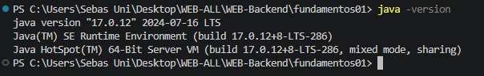

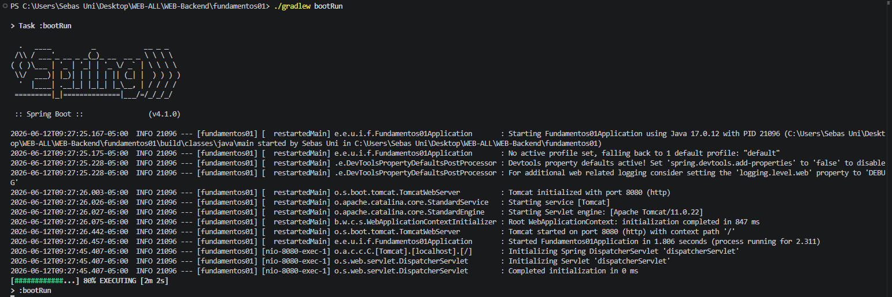

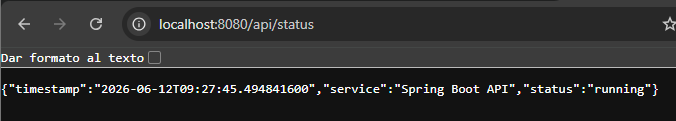

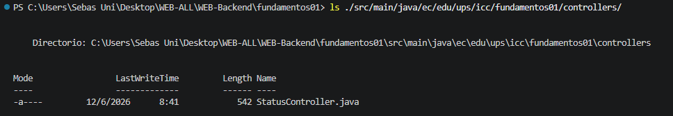

---

## Explicación breve de 02_estructura_proyecto

### ¿Por qué es importante tener módulos separados?

Separar un proyecto en módulos basados en dominios (como products, users, auth) imita la arquitectura de las aplicaciones empresariales reales. Esta organización divide las responsabilidades del sistema, lo que facilita la escalabilidad del proyecto, permite que múltiples desarrolladores trabajen en paralelo sin generar conflictos y simplifica la creación de pruebas unitarias al mantener el código altamente cohesivo.

### ¿Cómo se relacionan los Controllers, Services y Repositories?

Estas tres capas trabajan en conjunto siguiendo un flujo de comunicación estricto y unidireccional (Arquitectura MVCS):

* Controllers (Capa de Presentación): Son el punto de entrada de la API. Interceptan las peticiones HTTP del cliente, validan los datos de entrada y delegan la lógica pesada al servicio correspondiente. Finalmente, estructuran y devuelven la respuesta HTTP.

* Services (Capa de Negocio): Contienen el "corazón" de la aplicación. Reciben las instrucciones del controlador, ejecutan todas las reglas de negocio, validaciones o cálculos necesarios, y se comunican con el repositorio si necesitan guardar o extraer datos.

* Repositories (Capa de Persistencia): Se encargan exclusivamente de la comunicación con la base de datos (usando JPA/Hibernate). Reciben órdenes del servicio para insertar, actualizar, eliminar o buscar registros.

El flujo siempre es:
Cliente → Controller → Service → Repository → Base de Datos (y viceversa para la respuesta).

### ¿Qué problema evita mantener una estructura clara?

Mantener esta separación estricta evita el "código espagueti", una mala práctica donde la lógica de acceso a datos, las reglas de negocio y el manejo de rutas HTTP se mezclan en un solo archivo. Al evitar esto, se previenen problemas como el alto acoplamiento (donde cambiar una línea de código rompe otra parte del sistema de forma inesperada), la dificultad para rastrear errores ("bugs") y la imposibilidad de reutilizar el código en el futuro.

## Evidencias

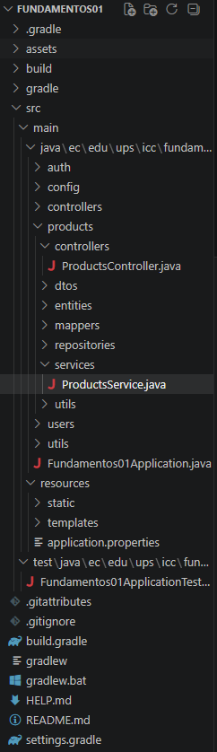
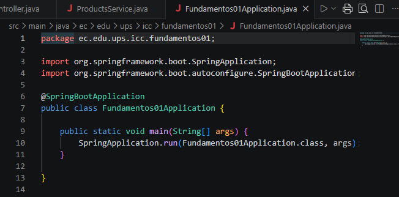
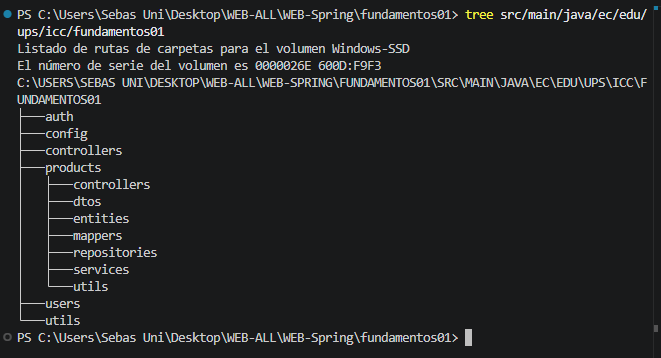

---

## Explicación breve de 03_api_rest

En esta práctica inicial, se estableció la cimentación de nuestra API RESTful orientada al recurso de productos. El objetivo principal fue comprender el ciclo de vida de una petición HTTP desde su recepción hasta la respuesta, gestionando los datos en memoria mediante una estructura de lista (List<UserModel>).

Para garantizar la seguridad y la correcta exposición de los datos, se implementó un patrón de diseño basado en DTOs (Data Transfer Objects). Esto permitió separar la estructura interna de los modelos de dominio de la información pública que se expone al cliente, utilizando Mappers para transformar los datos entre las capas de presentación y la lógica interna de manera automática. Se desarrollaron los seis endpoints fundamentales del CRUD, permitiendo operaciones completas de lectura, creación, actualización (total y parcial) y eliminación . 

## Evidencias

### Evidencias de endpoints (Products)

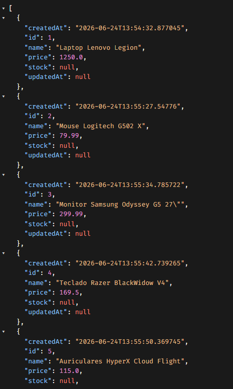
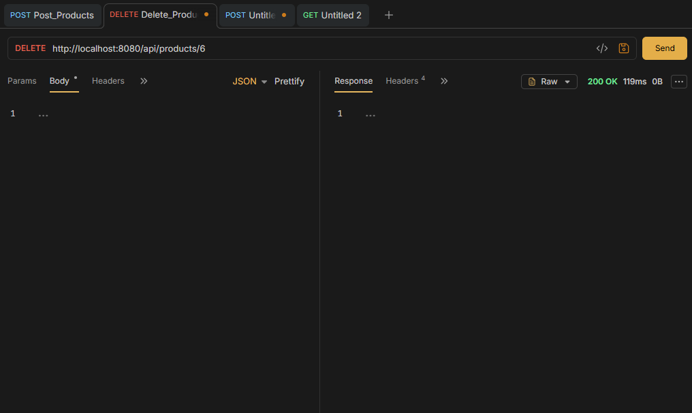
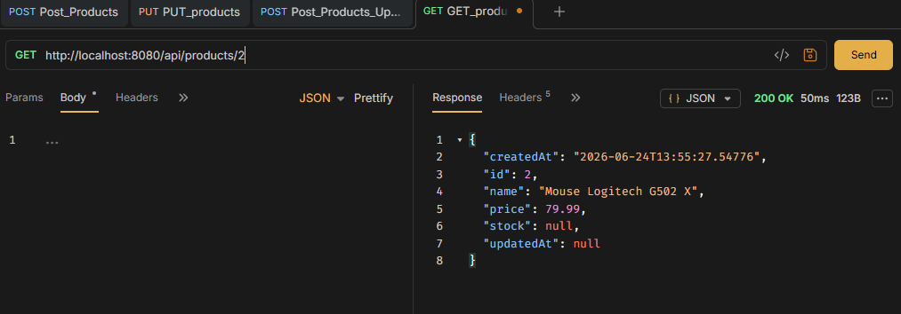
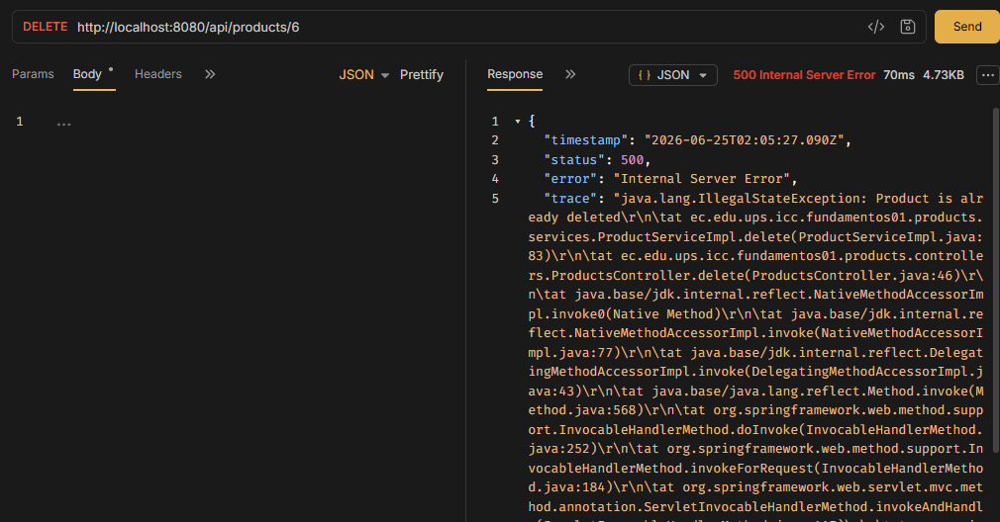

---

## Explicación breve de 04_servicios

En esta etapa, el proyecto evolucionó hacia una arquitectura de software más madura, aplicando el principio de Responsabilidad Única (SRP) . La lógica que anteriormente residía en los controladores se trasladó a una capa de servicios dedicada, permitiendo que los controladores se enfoquen exclusivamente en la gestión de peticiones HTTP.

### Arquitectura en Capas

El flujo de datos se reestructuró para favorecer un desacoplamiento efectivo:

1. Users/Products Controller: Actúa como el front-end de nuestra API, siendo el único punto de entrada para el cliente; su única responsabilidad es delegar la carga de trabajo al servicio correspondiente.

2. UserService/ProductService (Interfaz): Define el contrato de operaciones disponibles, lo que permite que el sistema sea flexible ante futuras implementaciones sin alterar el controlador.

3. ServiceImpl: Contiene la lógica de negocio y el estado del sistema (la lista en memoria), procesando los datos mediante la inyección de dependencias para operar sobre el modelo de dominio .

### Explicación de Inyección de Dependencias

Se implementó la Inyección de Dependencias por Constructor, una práctica recomendada en Spring Boot que mejora la legibilidad y facilita las pruebas unitarias. En lugar de instanciar manualmente los servicios dentro del controlador, Spring Boot detecta automáticamente las implementaciones marcadas con la anotación @Service y realiza el proceso de inyección de manera transparente al iniciar el contexto de la aplicación . Esto no solo reduce la complejidad del código, sino que garantiza que cada componente reciba sus dependencias necesarias en un entorno gestionado y seguro.

## Evidencias

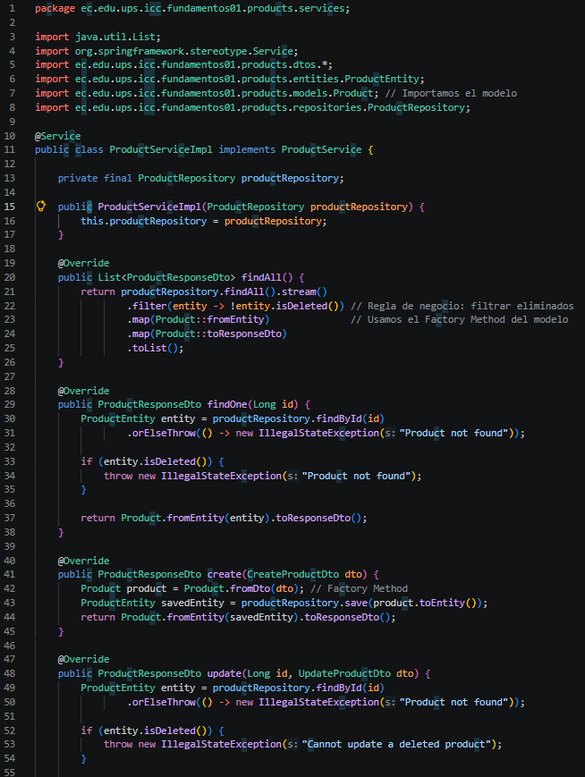
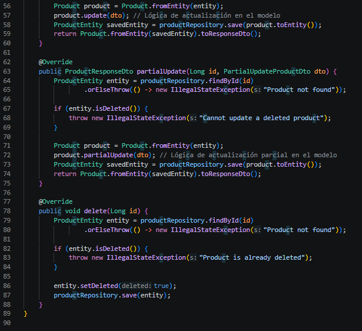
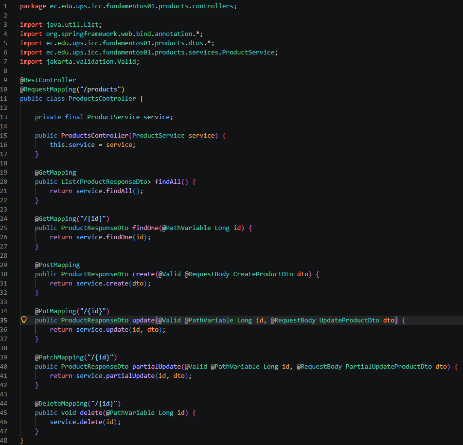

---

## Explicación breve de 05_repositorios_persistencia

### Resultados y Evidencias - Persistencia con PostgreSQL

En esta etapa de la práctica, se migró la persistencia de datos desde una lista en memoria hacia una base de datos real utilizando PostgreSQL, Spring Data JPA e Hibernate.

#### Flujo de Datos
Se implementó un flujo de arquitectura en capas que asegura el desacoplamiento entre la base de datos y la interfaz del usuario:

1. Cliente: Envía peticiones HTTP.

2. Controller: Recibe la petición y delega al servicio.

3. Service: Implementa la lógica de negocio y utiliza el repositorio para las operaciones. 

4. Repository: Ejecuta las operaciones de persistencia mediante JPA.

5. Entity: Representa la estructura de la tabla en PostgreSQL.

6. Mapper: Realiza la conversión entre DTO, Model y Entity.

#### Auditoría con BaseEntity
Se utilizó una superclase abstracta BaseEntity para centralizar la auditoría de todas las entidades . Esta clase, marcada con @MappedSuperclass, permite que UserEntity y ProductEntity hereden automáticamente los campos de auditoría (id, createdAt, updatedAt, deleted) sin duplicidad de código.

#### Evidencia: Lista de productos en PostgreSQL
Tras realizar las peticiones POST a través de la API, se verificó la persistencia mediante una consulta directa a la base de datos.

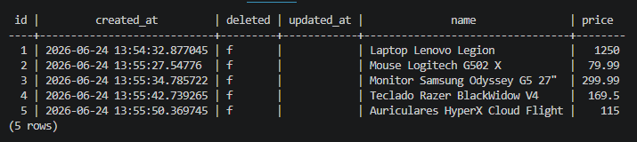

---

## Explicación de 06_ValidaciónDTOs_&_ReglasNegocio

En esta práctica, se implementó una capa de validación robusta utilizando **Jakarta Validation** para asegurar la integridad de los datos de entrada en los módulos de `users` y `products`.

### Implementaciones clave:
- [cite_start]**Validación de DTOs:** Se utilizaron anotaciones como `@NotBlank`, `@Size`, `@Email`, `@NotNull` y `@Min` para restringir los valores permitidos desde la capa de controlador mediante `@Valid` [cite: 625, 726-813, 1019-1040].
- [cite_start]**Lógica de Dominio:** Se refactorizó la arquitectura eliminando los *Mappers* externos, moviendo la lógica de conversión a *Factory Methods* dentro de las clases modelo (`Product.java`), lo cual facilita la construcción y conversión de entidades [cite: 625, 1026-1034].
- **Reglas de Negocio:** Se integraron validaciones en `ProductServiceImpl` para:
    - Evitar la actualización o eliminación de productos ya marcados como eliminados lógicamente.
    - [cite_start]Filtrar el listado (`findAll`) para no exponer productos eliminados [cite: 625, 1041-1045].

### Evidencias

**1. Validación de Entrada (Error 400):**
Al enviar datos que no cumplen las restricciones de validación, la API intercepta la petición y devuelve un error de tipo `Bad Request`.

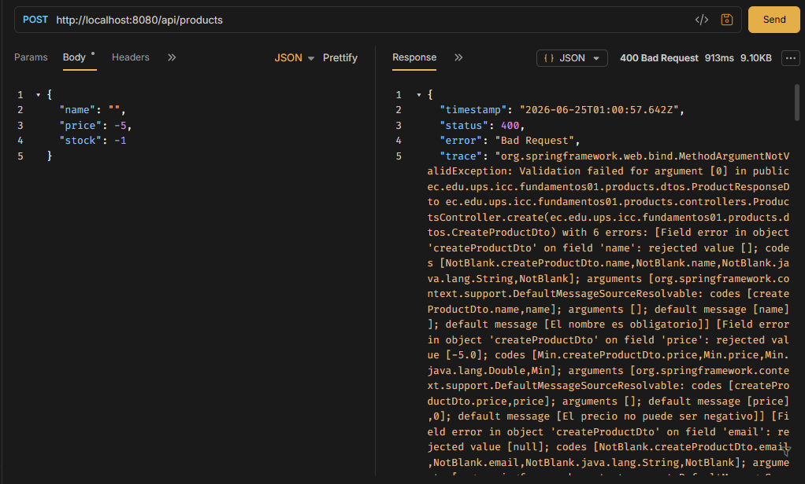

**2. Control de Reglas de Negocio:**
Se validó exitosamente que el sistema impide operar sobre productos eliminados y los excluye de las consultas generales, garantizando la consistencia de los datos.

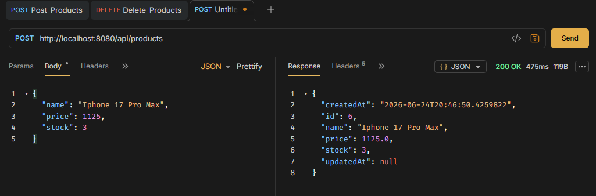
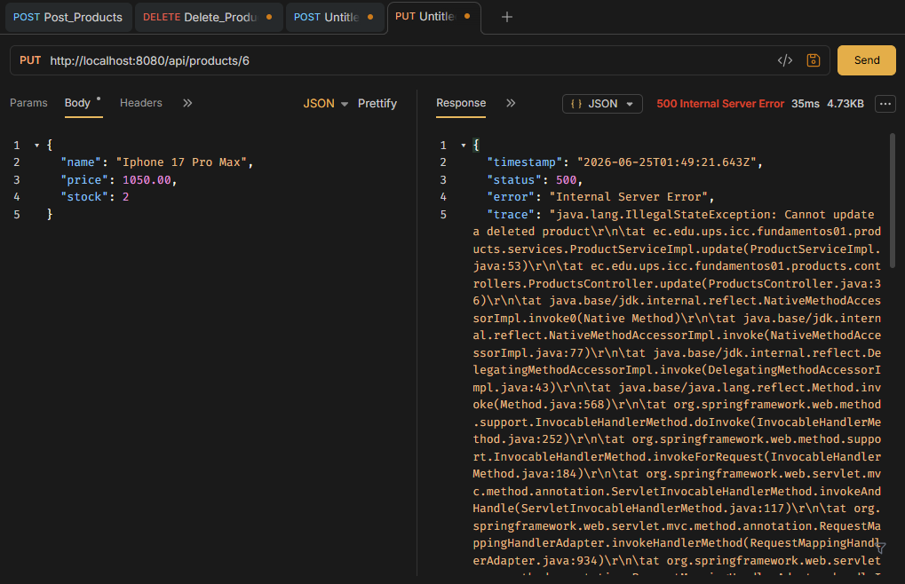


---

## Explicación de 07_Control_Errores

En esta práctica se implementó un sistema global de manejo de errores utilizando un `@RestControllerAdvice`. Esto permite centralizar las excepciones de la aplicación y devolver un formato único (`ErrorResponse`), eliminando los bloques try/catch de los controladores y evitando exponer trazas técnicas al cliente.

A continuación, se presentan las evidencias de las validaciones implementadas en el módulo de productos (`products/`).

### 1. Error por recurso inexistente (404 Not Found)

Se valida la búsqueda de un producto que no existe en la base de datos lanzando una `NotFoundException`. 

* Petición: `GET /api/products/5`
* Resultado Esperado: Estado HTTP `404 Not Found` y el mensaje "Product not found".

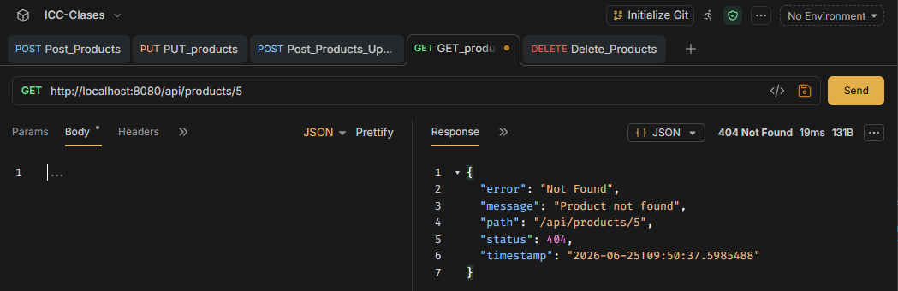

### 2. Error por conflicto de reglas de negocio (409 Conflict)

Se valida que no se pueda crear un producto con un nombre ya registrado, lanzando una `ConflictException`.

* Petición: `POST /api/products` (Enviando un JSON con un nombre que ya existe en la BD).
* Cuerpo enviado:
    ```json
    {
        "name": "Iphone 17 Pro Max",
        "price": 1125,
        "stock": 3
    }

* Resultado Esperado: Estado HTTP `409 Conflict` y el texto "Product name already registered".

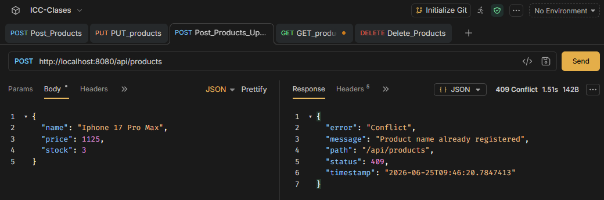

### 3. Error por validación de DTO (400 Bad Request)

Se valida la entrada de datos a través de las anotaciones `@Valid` en los DTOs. Si los datos no cumplen con los requisitos (nombres vacíos, precios o stock negativos), se captura la `MethodArgumentNotValidException`.

* Petición: `POST /api/products`
* Cuerpo enviado:
  ```json
  {
    "name": "",
    "price": -5,
    "stock": -1
  }
* Resultado Esperado: Estado HTTP `400 Bad Request`

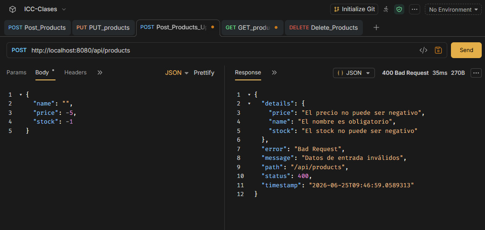

---

## Explicación de la Practica 08_relación_entidades


---

## Explicación de la Practica 09_relación_requestparam

### ¿Por qué se usa ProductService y ProductRepository para consultar productos aunque el endpoint esté en UsersController o CategoriesController?

Porque el contexto semántico de la URL (ej. /users/{id}/products) solo sirve para organizar la API de forma lógica para el cliente, pero el "recurso" principal que estamos consultando, filtrando y devolviendo sigue siendo un Producto. Delegar esta tarea al ProductRepository permite realizar consultas explícitas y eficientes a la base de datos (usando SQL con filtros WHERE y JOIN), en lugar de sobrecargar la memoria de la aplicación intentando navegar por las colecciones de un UserEntity o CategoryEntity mediante JPA.

### ¿Qué cambió al pasar de Product N - 1 Category a Product N - N Category?

1. Base de datos: Se eliminó la columna category_id de la tabla products y se generó una tabla intermedia automática llamada product_categories para almacenar los pares de IDs (producto - categoría).

2. JPA: Se reemplazó la anotación @ManyToOne por @ManyToMany y @JoinTable, usando colecciones (Set<CategoryEntity>) en lugar de un objeto individual.

3. Lógica de negocio y SQL: Se modificaron los DTOs para recibir arreglos de IDs (Set<Long> categoryIds). Además, las consultas en el repositorio pasaron de usar una simple igualdad (p.category.id = :id) a requerir un JOIN p.categories c acompañado de un SELECT DISTINCT p para evitar que la base de datos devuelva productos duplicados en el resultado.

---

## Explicación de la Practica 10_paginacion

### ¿Cuál es la diferencia entre Page y Slice?

Page ejecuta dos consultas SQL a la base de datos: una para traer los registros de la página actual y otra (COUNT) para calcular el total de elementos y páginas existentes. Esto lo hace ideal para tablas administrativas donde necesitas mostrar controles precisos (Ej: "Página 1 de 20").
Slice, en cambio, es mucho más ligero porque no hace la consulta de conteo (COUNT). Solo trae los registros solicitados más uno adicional para saber si hay una "página siguiente" (hasNext). Es ideal para flujos rápidos como "Scroll Infinito" en aplicaciones móviles o web.

### ¿Por qué la paginación debe aplicarse en el repositorio y no después de traer todos los datos a Java?

Porque evita la sobrecarga de la memoria (RAM) del servidor y el colapso del ancho de banda. Si la tabla tiene 100,000 productos y paginamos en Java, estaríamos obligando a la base de datos a enviar los 100,000 registros completos a través de la red, para luego descartar 99,990 en memoria. Al aplicar la paginación en el repositorio, la base de datos procesa los comandos LIMIT y OFFSET a nivel de SQL, enviando únicamente los 10 registros que el cliente solicitó, lo que resulta en respuestas de milisegundos.

---

